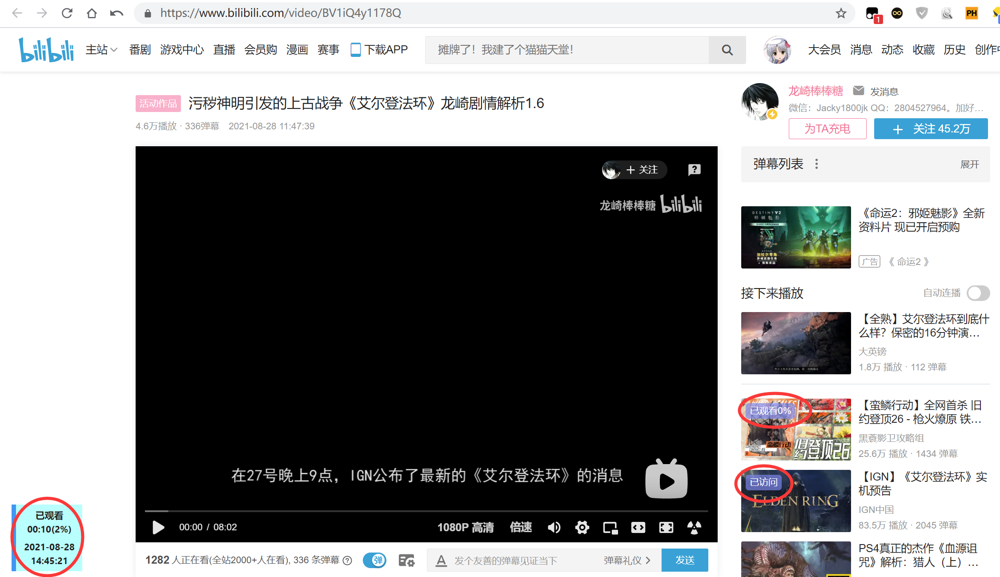

# Bilibili-video-History
Bilibili视频观看历史记录提示脚本
## 安装
1、安装 [Tampermonkey](https://tampermonkey.net/)

2、[点击安装](https://github.com/DreamNya/Bilibili-video-History/raw/main/Bilibili-video-History.user.js) 脚本 

## 前言：
1、本脚本纯原创，编写之前已尽全力搜索但未找到相似功能脚本，求人不如求自己，故自己动手编写此脚本。

2、作者本人非码农纯小白，没有系统学习过代码，所有代码纯靠baidu自学，此脚本代码可能存在诸多不合理之处。

2.5、由于懒得想变量名、函数名、故直接使用中文为主、英文为辅的变量名、函数名（随心所欲，气死不负责）

3、本脚本使用了Tampermonkey（油猴）内置函数，完全依赖Tampermonkey，仅在Chromium+Tampermonkey v4.13版本测试正常使用，其余环境均未进行测试。

4、如发现各种问题或BUG欢迎与作者联系。

5、本脚本仅记录普通视频观看记录，番剧、直播、漫画等不在脚本记录对象范围内。

6、本脚本主要是自用，其次是练手写写JS，最后才是发布分享，不保证后续更新。

## 免责声明：
本脚本完全免费、开源。作者不保证脚本不存在bug。如使用本脚本时因bug、使用不当等原因引起的任何损失、纠纷需用户自行承担，否则请勿使用本脚本。

## 原理：
通过Tampermonkey内置函数记录观看信息；使用jQuery每秒读取页面元素比对已记录观看信息返回观看记录结果。

（就这么简单，但我从来没见其他人做过。）

所有存储信息均保存在本地（准确来说是Tampermonkey存储目录），如换浏览器、换电脑后仍想保留之前观看记录需要自行备份导出导入存储信息（Tampermonkey自带的云同步似乎也可以自动做到）。

## 功能：
1、记录Bilibili已观看或已访问记录（包括观看类型、观看时长、观看百分比、观看时间、视频标题）

2、在视频页提示详细观看记录（第一次访问不会提示，仅在第二次访问后在视频页左下角进行提示）

2.5、左下角提示标签右键单击则直接删除本条观看记录，左键单击则直接跳转播放上次观看进度（已访问则无效果）

3、在首页、分区、UP主视频空间内实时提示简略观看记录（仅提示已观看+观看百分比或已访问。为防止页面长时间放置崩溃，仅实时提示600秒）

(4)、如配合【Bilibili Evolved】亦可在关注动态中提示简略观看记录

5、在顶部导航栏中历史、收藏；稍后观看、历史记录页面提示简略观看记录

## 已知问题\更新计划\更新记录：
详情查看[Bilibili-video-History.user.js](https://github.com/DreamNya/Bilibili-video-History/blob/main/Bilibili-video-History.user.js)
